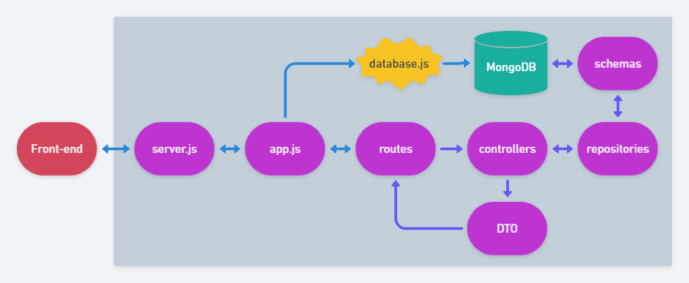

# veganAPI

 

## Problema

## Solução

## Arquitetura



## Ferramentas / Dependências

 - [VSCode](https://code.visualstudio.com/)
 - [nodejs](https://nodejs.org/)
 - [mongodb](https://www.mongodb.com/)
 - [npm](https://www.npmjs.com/)
 - [nodemon](https://www.npmjs.com/package/nodemon)
 - [mongoose](https://www.npmjs.com/package/mongoose)
 - [express](https://www.npmjs.com/package/express)
 - [cors](https://www.npmjs.com/package/cors)
 - [dotenv](https://www.npmjs.com/package/dotenv)
 - [path](https://www.npmjs.com/package/path)

## Schemas

### Produto
Campo | Tipo | Descrição | Obrigatório?
----- | ---- | --------- | -----------:
_id | ObjectId | Id gerado automaticamente | -
nome | String | Nome do produto | Sim
sabor | String | Sabor do produto | Não
tipo | ObjectId | Tipo do produto | Sim
fabricante | ObjectId | Fabricante do produto | Sim
vegan | Boolean | Se o produto é vegan ou não | Sim
ingredientesorigemanimal | Array | Lista contendo os ingredientes de origem animal | Não
imagem_url | String | URL para imagem do produto | Sim
observacao | String | Campo livre para observação | Não
createdAt | Date | Data de criação gerada automaticamente | -
updatedAt | Date | Data do último update gerada automaticamente | -

### Tipo
Campo | Tipo | Descrição | Obrigatório?
------ | ------- | --------- | ---------:
_id | ObjectId | Id gerado automaticamente | -
nome | String | Nome do tipo | Sim

### Fabricante
Campo | Tipo | Descrição | Obrigatório?
------ | ------- | --------- | ---------:
_id | ObjectId | Id gerado automaticamente | -
nome | String | Nome do fabricante | Sim
observacao | String | Campo livre para observação sobre o fabricante | Não

## Endpoints

Método | Caminho | Descrição
------ | ------- | ---------:
GET | /produtos | Retorna uma lista de produtos, podendo ser filtrada por parâmetro
GET | /produtos/:_id | Retorna um produto por id
POST | /produtos | Adiciona um produto
POST | /produtos/lista | Adiciona uma _array_ de produtos
PATCH | /produtos/:_id | Altera um produto
DELETE | /produto/:_id | Deleta um produto
GET | /tipos | Retorna todos os tipos
GET | /tipos/:_id | Retorna um tipo
POST | /tipos | Adiciona um tipo
PATCH | /tipos/:_id | Altera um tipo
DELETE | /tipos/:_id | Deleta um tipo
GET | /fabricantes | Retorna todos os fabricantes
GET | /fabricantes/:_id | Retorna um fabricante
POST | /fabricantes | Adiciona um fabricante
PATCH | /fabricante/:_id | Altera um fabricante
DELETE | /fabricante/:_id | Deleta um fabricante

Documentação no [Postman](https://documenter.getpostman.com/view/10647633/TVmV4YvT).

### Exemplo de um produto

```
{
    "_id": "5fcd57a039b60012dcfecaae",
    "nome": "Margarina Becel",
    "tipo": "Alimentício",
    "fabricante": "Unilever",
    "vegan": false,
    "ingredientesorigemanimal": [
        "Vitamina D3"
    ],
    "imagem_url": "https://casafiesta.fbitsstatic.net/img/p/creme-vegetal-becel-original-com-sal-250g-86113/251869.jpg",
    "data_criacao": "2020-12-06T22:13:52.361Z",
    "data_ultima_atualizacao": "2020-12-10T13:27:31.965Z"
}
```

## TODO

- Cadastro de usuários
- Submissão de revisão de informações por parte dos usuários
- Versões do mesmo produto por país, pois a receita é comumente alterada conforme a região.
- Cadastro de ingredientes que não sejam veganos e explicação.