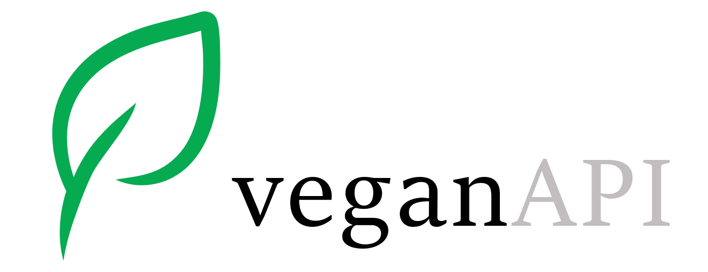

# veganAPI

 

## Problema

## Solução

## Arquitetura


## Ferramentas / Dependências

 - [VSCode](https://code.visualstudio.com/)
 - [nodejs](https://nodejs.org/)
 - [mongodb](https://www.mongodb.com/)
 - [npm](https://www.npmjs.com/)
 - [nodemon](https://www.npmjs.com/package/nodemon)
 - [mongoose](https://www.npmjs.com/package/mongoose)
 - [express](https://www.npmjs.com/package/express)
 - [cors](https://www.npmjs.com/package/cors)
 - [dotenv](https://www.npmjs.com/package/dotenv)
 - [path](https://www.npmjs.com/package/path)

## Schemas

### Produto
Campo | Tipo | Descrição | Obrigatório?
----- | ---- | --------- | -----------:
_id | ObjectId | Id gerado automaticamente. | -
nome | String | Nome do produto. | Sim
sabor | String | Sabor do produto. | Não
tipo | ObjectId | Tipo do produto. | Sim
fabricante | String | Fabricante do produto. | Sim
vegan | Boolean | Se o produto é vegan ou não. | Sim
ingredientesorigemanimal | Array | Lista contendo os ingredientes de origem animal. | Não
imagem_url | String | URL para imagem do produto. | Sim
observacao | String | Campo livre para observação. | Não
createdAt | Date | Data de criação gerada automaticamente. | -
updatedAt | Date | Data do último update gerada automaticamente. | -

### Tipo
Campo | Tipo | Descrição | Obrigatório?
------ | ------- | --------- | ---------:
_id | ObjectId | Retorna todos os produtos. | -
nome | String | Retorna um produto. | Sim

## Endpoints

Método | Caminho | Descrição
------ | ------- | ---------:
GET | /produtos | Retorna uma lista de produtos, podendo ser filtrada por parâmetro.
GET | /produtos/:_id | Retorna um produto por id.
POST | /produtos | Adiciona um produto.
POST | /produtos/lista | Adiciona uma _array_ de produtos.
PUT | /produtos/:_id | Altera um produto.
DELETE | /produto/:_id | Deleta um produto.
GET | /tipos | Retorna todos os tipos.
GET | /tipos/:_id | Retorna um tipo.
POST | /tipos | Adiciona um tipo.
PUT | /tipo/:_id | Altera um tipo.
DELETE | /tipo/:_id | Deleta um tipo.

### Exemplo de um produto

```
{
    "ingredientesorigemanimal": [
        "Vitamina D3"
    ],
    "_id": "5fcd57a039b60012dcfecaae",
    "nome": "Margarina Becel",
    "tipo": {
        "_id": "5fccec53c4568c120829bb37",
        "nome": "Alimentício",
        "__v": 0
    },
    "fabricante": "Unilever",
    "vegan": false,
    "imagem_url": "https://casafiesta.fbitsstatic.net/img/p/creme-vegetal-becel-original-com-sal-250g-86113/251869.jpg",
    "createdAt": "2020-12-06T22:13:52.361Z",
    "updatedAt": "2020-12-06T22:13:52.361Z",
    "__v": 0
}
```

## TODO

- Cadastro de usuários
- Submissão de revisão de informações por parte dos usuários
- Versões do mesmo produto por país, pois a receita é comumente alterada conforme a região.